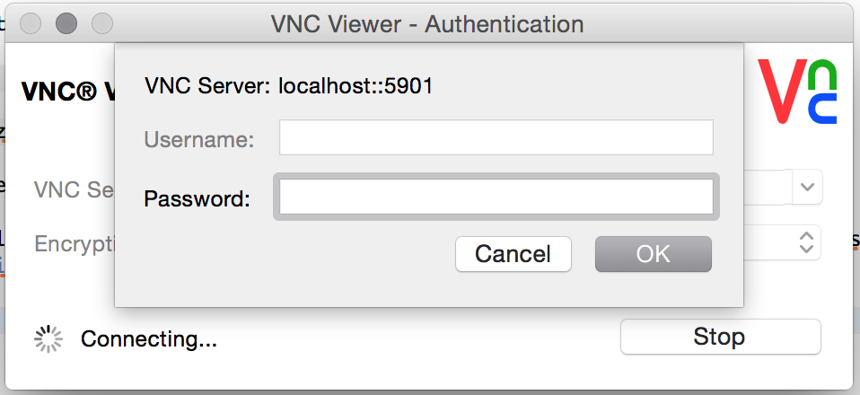
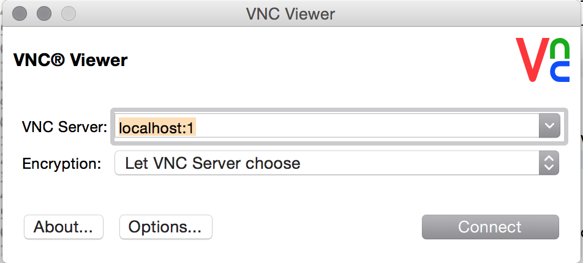
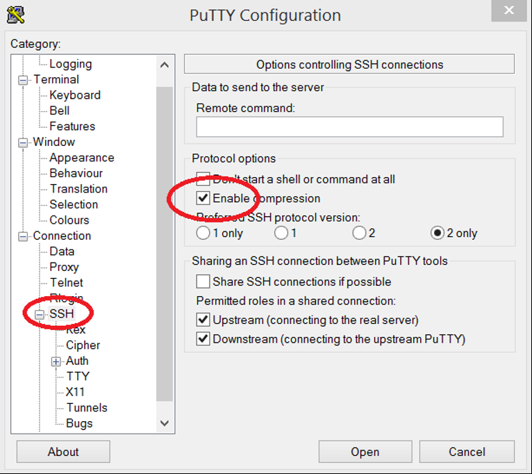
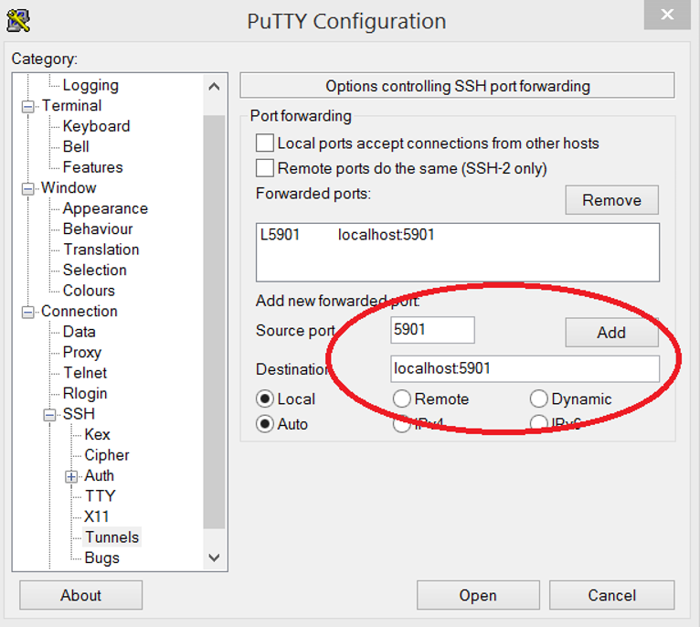
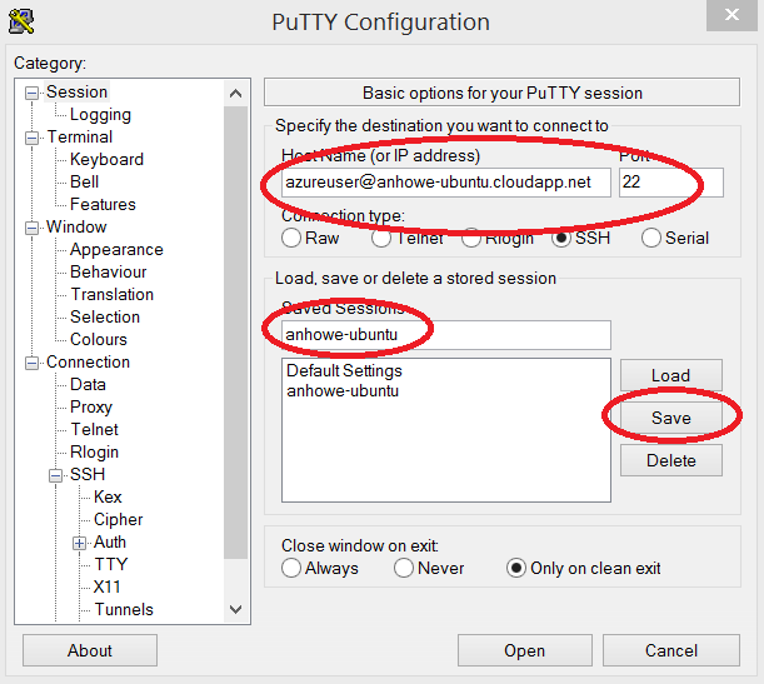
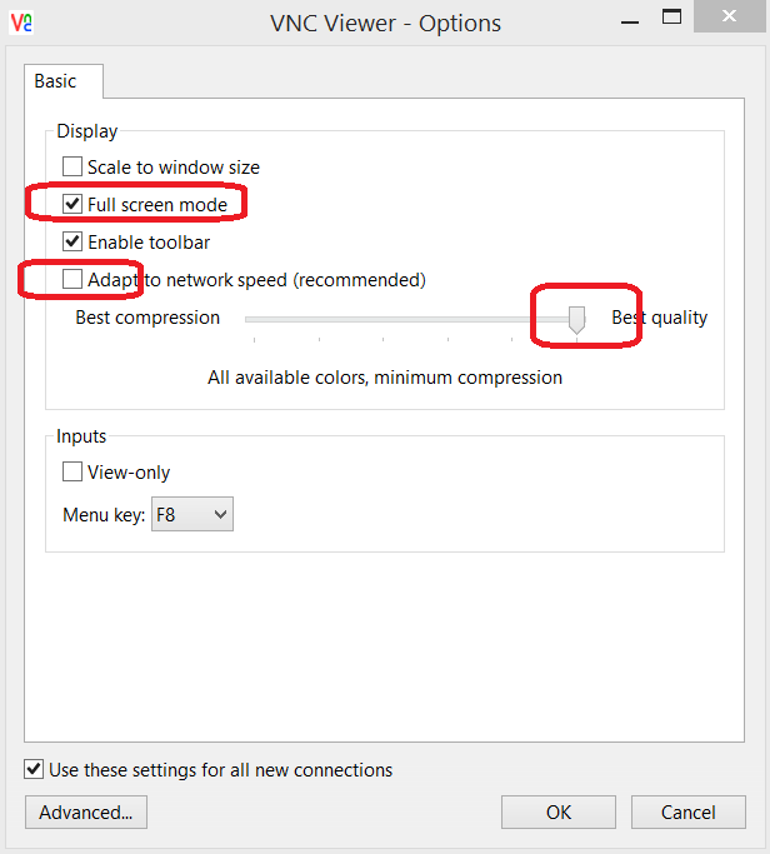
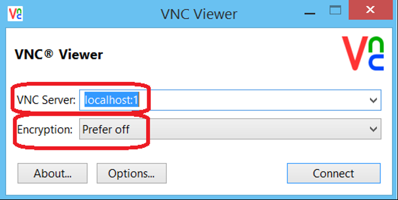

# Ubuntu Desktop VM in ARM

This is an Azure template to create an Ubuntu Desktop VM.  This is great as a jumpbox behind a NAT.

<a href="https://portal.azure.com/#create/Microsoft.Template/uri/https%3A%2F%2Fraw.githubusercontent.com%2Fanhowe%2Fubuntu-devbox%2Fmaster%2Fazuredeploy.json" target="_blank">
    
</a>

Below are the parameters that the template expects:

| Name   | Description    |
|:--- |:---|
| newStorageAccountName  | Name for the Storage Account where the Virtual Machine's disks will be placed.If the storage account does not aleady exist in this Resource Group it will be created. |
| adminPassword  | Password for the Virtual Machine  |
| dnsNameForPublicIP  | Unique DNS Name for the Public IP used to access the master Virtual Machine. |
| vmsize | specify an azure vm size for the machine |

This template runs quickly, but the overall install takes about 1 hour to complete.  You can SSH into the VM and watch /var/log/azure/cluster-bootstrap.log to see progress.

Once complete, you can create a compressed SSH tunnel to VNC port 5901, and then use VNC to see the desktop.  You can edit ~azureuser/bin/startvnc to adjust the resolution of the desktop.  Be sure to enable compression on the tunnel, otherwise performance will be sluggish.  Instructions for accessing from Windows are below.

# Accessing from Mac
To connect to your new Ubuntu desktop machine from a Mac machine you can use VNCViewer (you can download a version for the Mac at https://www.realvnc.com/download/viewer/

1. on a shell window, connect to the Ubuntu machine using the following command:
```
 ssh -L 5901:127.0.0.1:5901 <your username>@FQDN of the name
 
 ex. ssh -L 5901:127.0.0.1:5901 azureuser@mybox.westus.cloudapp.azure.com
```
2. vncviewer asks for a password in order to start the session. The default password is 'password'. You can chan
 

Once the ssh session is successfully created, you can launch the VNCViewer app and connect to localhost:1
 

NOTE: vncviewer may ask for 
 
# Accessing from Windows

These instructions walk through on how to setup a fast secure remote desktop session to your new Ubuntu Desktop machine.

1. Prerequisites - install the following software
 1. Putty - enables SSH with a secure compressed tunneling for remote desktop - http://www.chiark.greenend.org.uk/~sgtatham/putty/download.html
 2. vncviewer (64 bit) - allows remote desktop - https://www.realvnc.com/download/viewer/

2. Setup compressed vnc tunneling in putty - this enables a secure and fast tunnel through SSH for your remote desktop experience
 1. Run putty
 2. Enable compression, this allows for a fast remote desktop experience
 
 3. Add a tunnel - this enables a secure remote desktop over ssh.
 
 4. save your session
 

3. Connect to your linux with VNC
 1. Open vnc
 2. Click "options" and ensure best quality is chosen (note that the SSH tunnel you setup previously will handle compression)
 
 3. since the ssh provides encryption and to get maximum speed from ssh compression, turn off encryption, and open your session to "localhost:1".  ":1" represents port 5901, which you had previously setup with the ssh tunnel:
 
 4. now you should be connected to your session.
